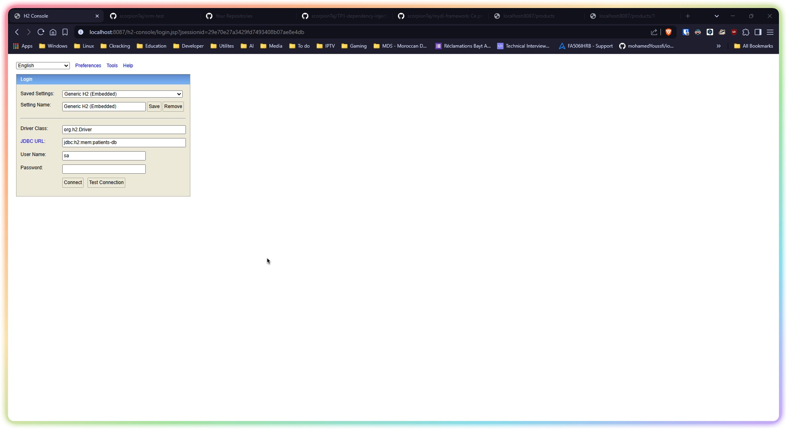
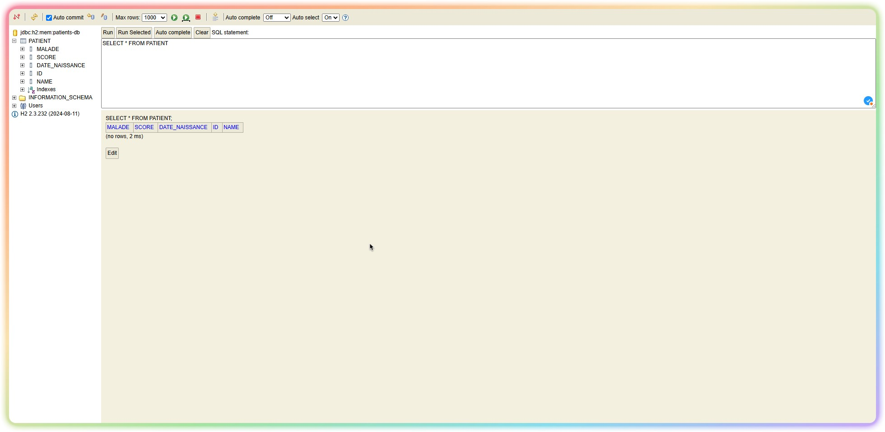
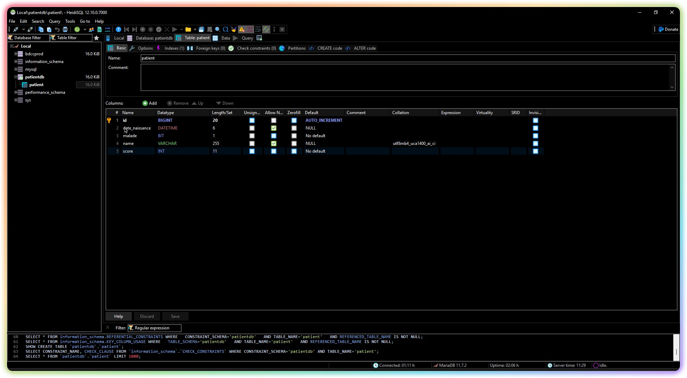
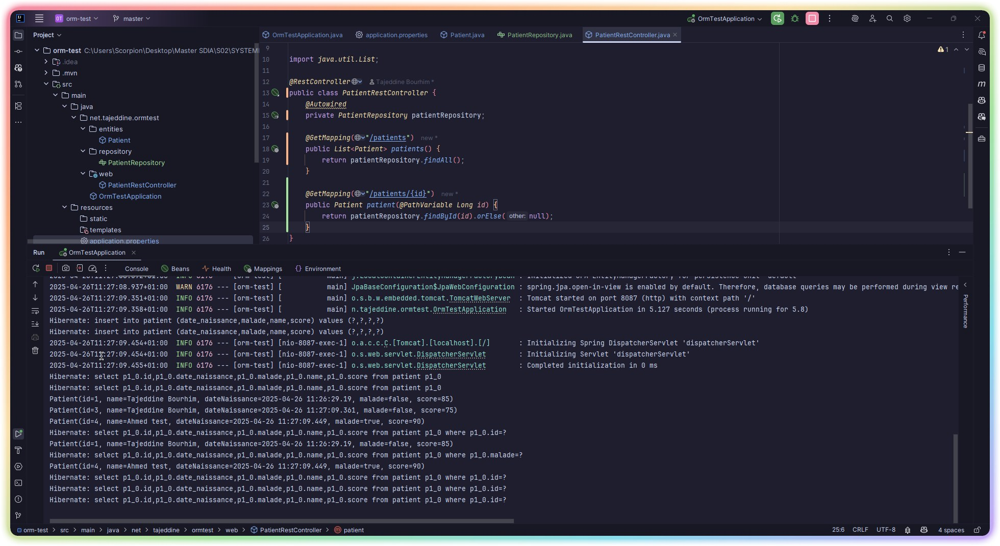
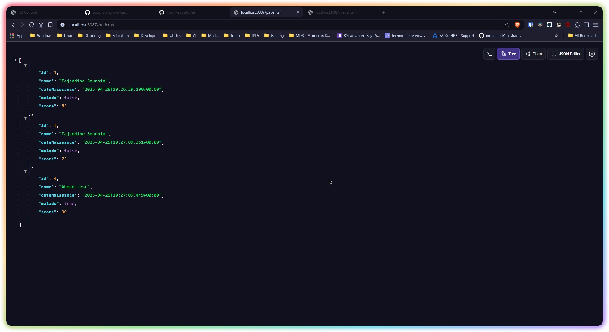
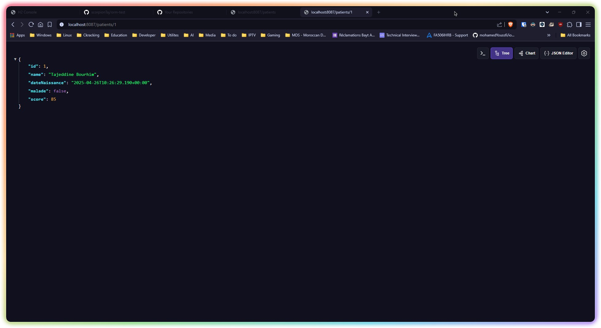

# ORM Test Project

A project to demonstrate and test Object-Relational Mapping (ORM) concepts in distributed systems and middleware.

---

## Table of Contents
1. [Introduction](#introduction)
2. [Features](#features)
3. [Installation](#installation)
4. [Usage](#usage)
5. [Technologies Used](#technologies-used)
6. [Project Structure](#project-structure)
7. [Setup Instructions](#setup-instructions)
8. [Testing](#testing)
9. [Screenshots](#screenshots)
10. [License](#license)

---

## Introduction

This project is part of the **Master SDIA** program, specifically for the course on **Distributed Systems and Middleware**. It explores the implementation and testing of ORM techniques.

---
## Features
- Add, update, delete, and retrieve patient records.
- Search patients by name or health status.
- Switch between H2 Database and MySQL (MariaDB).
- Expose RESTful APIs for patient management.

---

## Installation

Follow these steps to set up the project:

1. Clone the repository:
   ```bash
   git clone https://github.com/scorpionTaj/orm-test.git
   ```
2. Navigate to the project directory:
   ```bash
   cd orm-test
   ```
3. Install dependencies:
   ```bash
   maven clean install
   ```

---

## Usage

1. Start the application:
   ```bash
   maven spring-boot:run
   ```
2. Access the application at `http://localhost:8087`.

3. Run tests:
   ```bash
   mvn exec:java -Dexec.mainClass="net.tajeddine.ormtest.OrmTestApplication"
   ```

---
## Technologies Used
- **Java**: Programming language.
- **Spring Boot**: Framework for building the application.
- **Spring Data JPA**: For database interaction.
- **H2 Database**: In-memory database for development and testing.
- **MySQL (MariaDB)**: Relational database for production.
- **Lombok**: To reduce boilerplate code.
- **Maven**: Build tool.
---
## Project Structure
- `entities/Patient.java`: Defines the `Patient` entity.
- `repository/PatientRepository.java`: JPA repository for database operations.
- `web/PatientRestController.java`: REST controller for exposing APIs.
- `OrmTestApplication.java`: Main application class with a `CommandLineRunner` for testing.
---
## Setup Instructions

### Prerequisites
- Java 17 or higher
- Maven
- IntelliJ IDEA (or any IDE of your choice)
- MySQL (if using MariaDB)

### Steps to Run
1. Clone the repository.
2. Open the project in IntelliJ IDEA.
3. Configure the database in `application.properties`:
    - For H2:
      ```ini
      spring.datasource.url=jdbc:h2:mem:testdb
      spring.datasource.driver-class-name=org.h2.Driver
      spring.datasource.username=sa
      spring.datasource.password=
      spring.jpa.hibernate.ddl-auto=create
      spring.jpa.show-sql=true
      spring.h2.console.enabled=true
      ```
    - For MySQL (MariaDB):
      ```ini
      spring.datasource.url=jdbc:mysql://localhost:3306/patientdb?createDatabaseIfNotExist=true
      spring.datasource.username=root
      spring.datasource.password=your_password
      spring.jpa.hibernate.ddl-auto=update
      spring.jpa.properties.hibernate.dialect=org.hibernate.dialect.MariaDBDialect
      spring.jpa.show-sql=true
      ```
4. Run the application using the `OrmTestApplication` class.
5. Access the H2 console at `http://localhost:8080/h2-console` (if using H2).
6. Access the REST APIs:
    - Get all patients: `GET /patients`
    - Get a patient by ID: `GET /patients/{id}`


## Screenshots

### H2 Database Connection


### H2 Database View


### MariaDB Connection


### MariaDB View


### IntelliJ IDEA Console


### Web App - JSON View of Patients


### Web App - JSON View of a Patient by ID


## Testing
The application includes a `CommandLineRunner` in the `OrmTestApplication` class to test the following operations:
- Adding patients.
- Retrieving all patients.
- Retrieving a patient by ID.
- Searching patients by health status.
- Updating a patient's score.
- Deleting a patient.

## License

This project is licensed under the MIT License. See the [LICENSE](LICENSE) file for details.